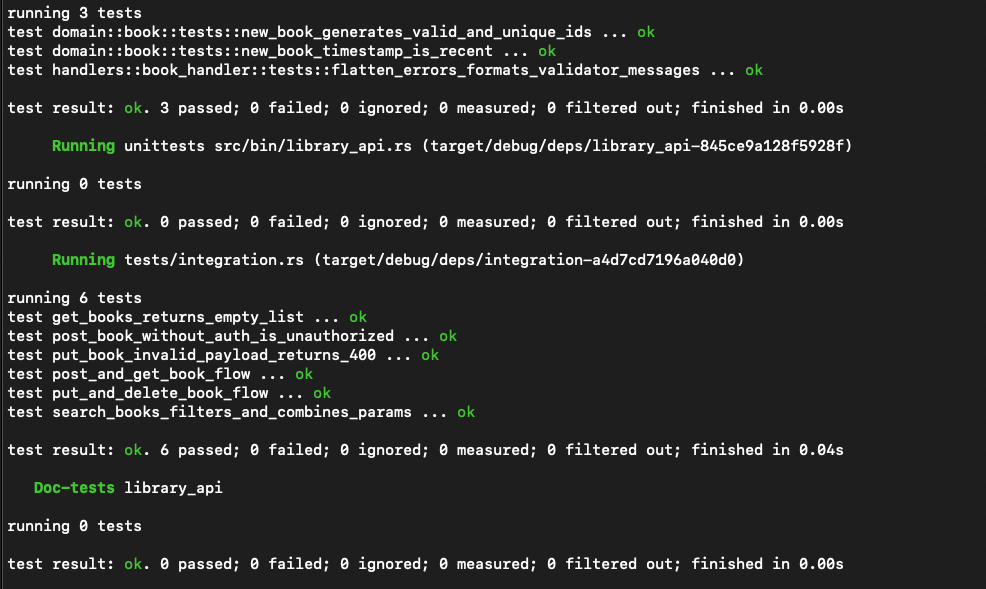

# library_api

A RESTful API in Rust for managing a library of books using SQLite and JWT authentication.

---

## Table of Contents

1. [Prerequisites](#prerequisites)
2. [Clone the Repository](#clone-the-repository)
3. [Environment Setup](#environment-setup)
4. [Database Migrations](#database-migrations)
5. [Build & Run](#build--run)
6. [API Endpoints](#api-endpoints)
7. [Testing](#testing)
8. [Examples (curl & Postman)](#examples-curl--postman)
9. [Architecture & Documentation](#architecture--documentation)
10. [Logging](#logging)
11. [Optional Features](#optional-features)
12. [Docker (Optional)](#docker-optional)

---

## Prerequisites

- **Rust** (1.70+ recommended) and **Cargo**
- **SQLite** for local development
- **sqlx-cli** for migrations:
  ```bash
  cargo install sqlx-cli --no-default-features --features sqlite
  ```  
- **Git** to clone the repository

---

## Clone the Repository

```bash
git clone git@github.com:del-cueto/library_api.git
cd library_api
```

---

## Environment Setup

Create a `.env` file in the project root:

```env
DATABASE_URL=sqlite://./library.db
JWT_SECRET=your-secret-key
```

- `DATABASE_URL` can be relative (`./library.db`) or absolute.
- `JWT_SECRET` should be a strong random string.

> **Note:** The app uses `dotenvy`, so `.env` is loaded automatically.

---

## Database Migrations

Ensure `.env` is loaded:

```bash
source .env
```

Run migrations:

```bash
sqlx migrate run
```

This creates the `books` table in `library.db`.

> **Screenshot:**  
> _Add a screenshot of the migration command and result here._

---

## Build & Run

Compile in release mode:

```bash
cargo build --release
```

Run the server:

```bash
cargo run --bin library_api
```

By default, the server listens on `http://127.0.0.1:3000`.

> **Screenshot:**  
> _Add a screenshot of the server startup log here._

---

## API Endpoints

### Public

- `POST /login`
    - Body:
      ```json
      { "username": "admin", "password": "password" }
      ```
    - Returns: JWT token (string)

- `GET /books`
    - List all books

- `GET /books/{id}`
    - Get a book by ID

- `GET /books/search?title=...&author=...`
    - Search by title and/or author (partial match)

### Protected (requires `Authorization: Bearer <token>`)

- `POST /books`
    - Body:
      ```json
      { "title":"...", "author":"...", "published_year":2025 }
      ```

- `PUT /books/{id}`
    - Body: any subset of fields to update

- `DELETE /books/{id}`

---

## Testing

Run all tests (unit + integration):

```bash
cargo test
```

Integration tests use an in-memory SQLite DB and cover login, CRUD, search, and error cases.

> **Screenshot:**  
> _Output of caro test._

---

## Examples (curl & Postman)

#### curl

```bash
# Obtain token
TOKEN=$(curl -s -X POST http://127.0.0.1:3000/login   -H 'Content-Type: application/json'   -d '{"username":"admin","password":"password"}')

# Create a book
curl -X POST http://127.0.0.1:3000/books   -H "Authorization: Bearer $TOKEN"   -H 'Content-Type: application/json'   -d '{"title":"Test","author":"Me","published_year":2025}'

# List books
curl http://127.0.0.1:3000/books
```

> **Postman Collection:**  
> _You can get the original postman collection here._
https://www.postman.com/flight-physicist-5822942/library-api/collection/3ue5ydg/library-api?action=share&creator=34740066
---

## Architecture & Documentation

- **Clean Architecture**: separation into `domain`, `app` (service logic), `infra` (DB), `handlers` (HTTP), `middleware`.
- **Web Framework**: [axum] for routing and extractors.
- **Error Handling**: centralized via `AppError` enum and `IntoResponse` implementations, returning JSON:
  ```json
  { "error": "message" }
  ```


---

## Logging

Structured logging with [`tracing`]: spans around request handlers. Logs output to stdout.

---


---

**References**
- [axum](https://crates.io/crates/axum)
- [sqlx](https://crates.io/crates/sqlx)
- [validator](https://crates.io/crates/validator)
- [jsonwebtoken](https://crates.io/crates/jsonwebtoken)
